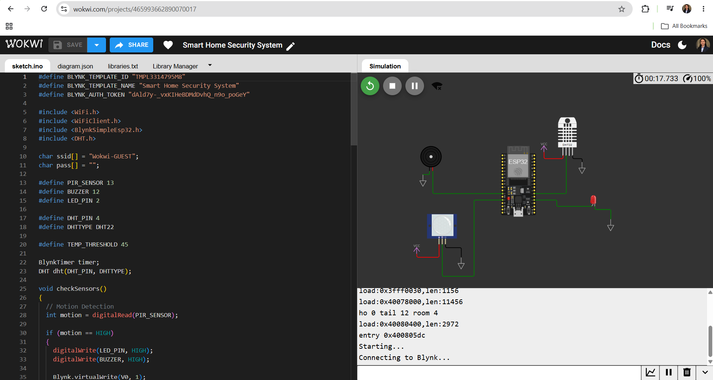
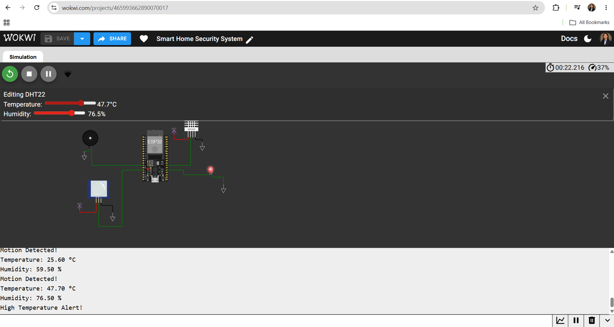

# Smart-Home-Security-System
IoT-based Smart Home Security System using ESP32, PIR Sensor, DHT22 and Blynk IoT.
# 🏠 Smart Home Security System

An IoT-based Smart Home Security System developed using **ESP32**, **PIR Motion Sensor**, **DHT22 Sensor**, **Blynk IoT**, and **Wokwi Simulator**. The system provides real-time home monitoring by detecting motion, monitoring environmental conditions, and sending instant alerts through the Blynk cloud platform.

## 📌 Project Overview

This project is designed to improve home security by continuously monitoring motion, temperature, and humidity. Whenever motion is detected or the temperature exceeds the predefined threshold, the system activates a local alarm and updates the Blynk dashboard in real time.

## ✨ Features

* Motion Detection using PIR Sensor
* Real-time Temperature Monitoring
* Real-time Humidity Monitoring
* High Temperature Alert
* LED and Buzzer Alarm
* Remote Monitoring using Blynk IoT
* Wi-Fi Connectivity using ESP32
* Cloud-based Notifications
* Real-time Sensor Data Visualization

## 🛠 Hardware Components

* ESP32 Development Board
* PIR Motion Sensor
* DHT22 Temperature & Humidity Sensor
* LED
* Buzzer
* Jumper Wires
* Breadboard (Optional)

## 💻 Software & Tools

* Arduino IDE
* Wokwi Simulator
* Blynk IoT Platform
* GitHub

## ⚙ Working Principle

1. ESP32 connects to Wi-Fi and the Blynk Cloud.
2. The PIR sensor continuously monitors motion.
3. The DHT22 sensor measures temperature and humidity.
4. When motion is detected:

   * LED turns ON.
   * Buzzer is activated.
   * Motion status is updated on the Blynk dashboard.
   * An intrusion notification is generated.
5. When the temperature exceeds the predefined threshold:

   * Buzzer is activated.
   * High Temperature Alert is generated.
   * Fire Status is updated on the dashboard.
6. Users can monitor all sensor values remotely through the Blynk dashboard.

## 📊 Blynk Datastreams

| Datastream | Description            |
| ---------- | ---------------------- |
| V0         | Motion Status          |
| V1         | Temperature            |
| V2         | Humidity               |
| V3         | High Temperature Alert |

## 📸 Project Screenshots

### Circuit Diagram

### Wokwi Simulation

### Blynk Dashboard

### Serial Monitor

## 🔗 Live Simulation

**Wokwi Project**

<PASTE_YOUR_WOKWI_PROJECT_LINK_HERE>

## 🚀 Applications

* Smart Home Security
* Office Security
* Warehouse Monitoring
* Laboratory Safety
* Smart Building Automation
* IoT-Based Surveillance

## 🔮 Future Enhancements

* Smoke/Gas Sensor Integration
* Camera-Based Intruder Detection
* Mobile App Control
* Email and SMS Notifications
* Cloud Data Logging
* AI-Based Threat Detection

## 👩‍💻 Author

**Shreya Patil**

B.Tech Electrical Engineering

## 📄 License

This project is licensed under the MIT License.

